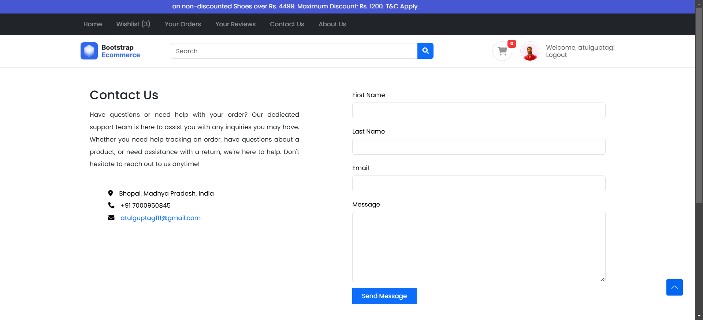
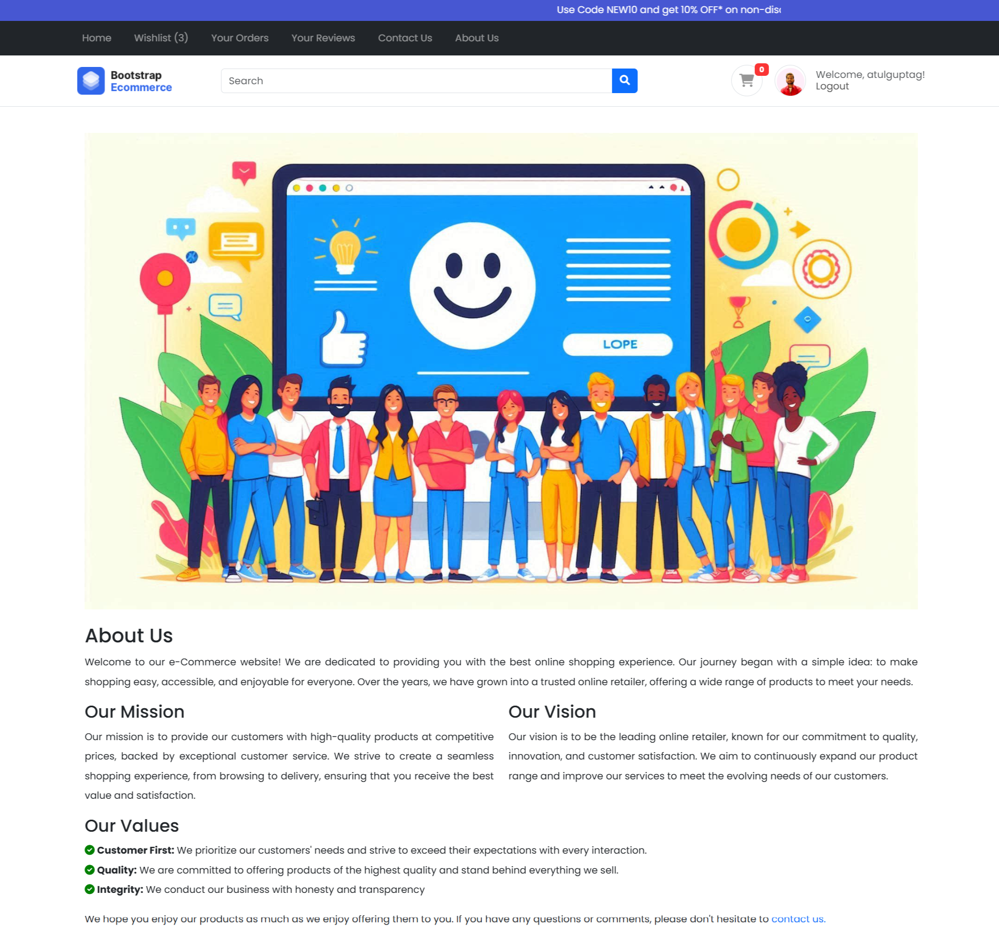
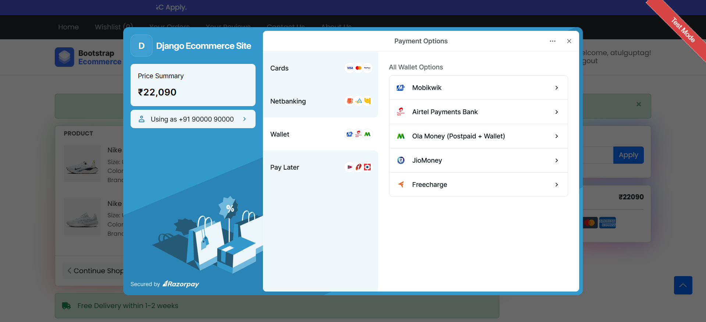
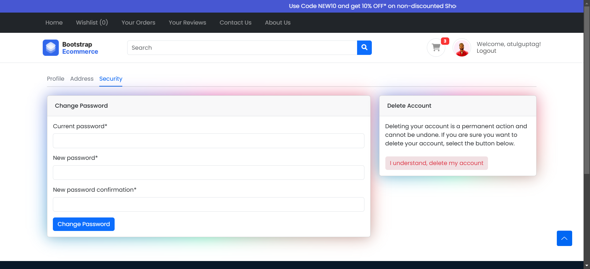

# Django eCommerce Website

<div align="center">

[](https://github.com/atulguptag/Django-eCommerce-Website/issues)


[](https://github.com/atulguptag/Django-eCommerce-Website/contributors)
[](https://djangoecommercewebsite.pythonanywhere.com/)


</div>

This project is a full-fledged eCommerce website built using Django, a high-level Python web framework. It includes essential features such as user authentication, product browsing, cart management, checkout process, payment integration, and more. The website is designed to be robust, scalable, and user-friendly, providing a seamless shopping experience for customers.

## Table of Contents

- [Features](#features)
- [Screenshots](#screenshots)
- [Technologies Used](#technologies-used)
- [Setup Instructions](#setup-instructions)
- [Usage](#usage)
- [Contributing](#contributing)
- [License](#license)

## Features

- **User Authentication:** Secure user registration, login, reset password, and profile management.
- **Product Catalog:** Browse and search products with detailed descriptions and images.
- **Shopping Cart:** Add, update, and remove items from the cart seamlessly.
- **Checkout Process:** Smooth checkout flow with order summary and address management.
- **Payment Integration:** Integrated with Razorpay for secure online payments.
- **Order Management:** View order history and status updates.
- **Responsive Design:** Mobile-friendly UI ensuring a consistent experience across devices.
- **Admin Panel:** Manage products, orders, and users efficiently through Django's admin interface.

## Screenshots

### Home Page


### Wishlist Page


### Order History Page


### Order Details Page


### Contact-Us Page



### About-Us Page



### Product Page


### Shopping Cart Page


### Payment Testing View Page



### Payment Success Page


### Login Page


### Register Page


### Reset Password Page


### Profile Page


### Shipping Address Page


### Change Password View



## Technologies Used

- **Django:** Python-based web framework for backend development.
- **HTML/CSS/JavaScript:** Frontend development for a responsive and interactive UI.
- **Razorpay API:** Payment gateway integration for secure transactions.
- **Bootstrap:** Frontend framework for responsive design and UI components.

## Setup Instructions

To run this project locally, follow these steps:

1. **Clone the repository:**

   ```bash
   git clone https://github.com/atulguptag/Django-eCommerce-Website.git
   cd Django-eCommerce-Website
   ```

2. **Create a virtual environment:**
   ```bash
   python -m venv venv
   ```
3. **Activate the virtual environment:**

   - On Windows:
     ```bash
     .\venv\Scripts\activate
     ```
   - On macOS/Linux:
     ```bash
     source venv/bin/activate
     ```

4. **Install dependencies:**
   ```bash
   pip install -r requirements.txt
   ```

### `Note`: Before running `python manage.py migrate`, first create `.env` file in your project root, and update it with the same as `.env.example`

- Then, add `SECRET_KEY` and `DEBUG=True` in `.env` file -

- **How to generate/get the SECRET_KEY?**

- Open your terminal (make sure your virtual environment is activated, it should be something like this - `(venv) PS C:\Users\asus\Django-eCommerce-Website`)

- then type `django-admin shell`, and hit enter.

- Paste the below code into your shell (use mouse right side button to paste the copied code, `as Ctrl+V may not work`)-

  ```bash
  from django.core.management.utils import get_random_secret_key
  get_random_secret_key()
  ```

* Copy the `SECRET_KEY`(whatever you got in the output), and paste it in your `.env` file after `SECRET_KEY=`.

* Now, you are good to go :) -

5. **Apply database migrations:**

   ```bash
   python manage.py migrate
   ```

6. **Create a superuser (admin):**

   ```bash
   python manage.py createsuperuser
   ```

7. **Start the development server:**

   ```bash
   python manage.py runserver
   ```

8. **Open your web browser and navigate to:**
   ```
   http://127.0.0.1:8000/
   ```

### `Note`: After you navigate to the above url (`http://127.0.0.1:8000/`), and when you try to navigate to the login, signup, or any page which requires login, then you'll see an error coming from the Social Account Model. If you don't want to add google auth functionality in your project, you can simply remove all social account related things in the code. In case, if you want to proceed with the default, then here's how you can fix that error -

- Follow this step: navigate to `http://127.0.0.1:8000/admin/`, enter your `username and password` which you used to create in `Step no: 6`
- then follow this screenshot for better understanding :) -

- 

- Simply, put your Google Client Id and Secret Id in those two places which I highlighted.

- Now, you are ready to rock 🎉🤘🏻

## Usage

- **Admin Panel:** Access the admin panel at `http://127.0.0.1:8000/admin/` to manage products, orders, and users.
- **Shopping:** Browse products, add items to the cart, proceed to checkout, and make payments using Razorpay.
- **Profile:** Users can register, login, reset their password, view their order history, and update their profiles.

## Contributing

Contributions are welcome! Please fork this repository and create a pull request with your proposed features, enhancements, or bug fixes.

## License

This project is licensed under the [MIT License](LICENSE).

## 💰 You can help me by Donating. Any small amount will help me to create more projects like this in future 😀. Otherwise, it is not necessary.

[](https://paypal.me/atulguptaa)
# growsmart
# growsmart
# ecomm
# ecomm
# ecomm
# ecommerce
# ecommerce
# ecommerce-app
